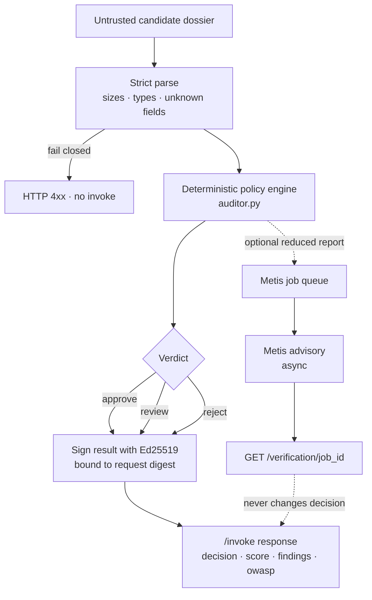
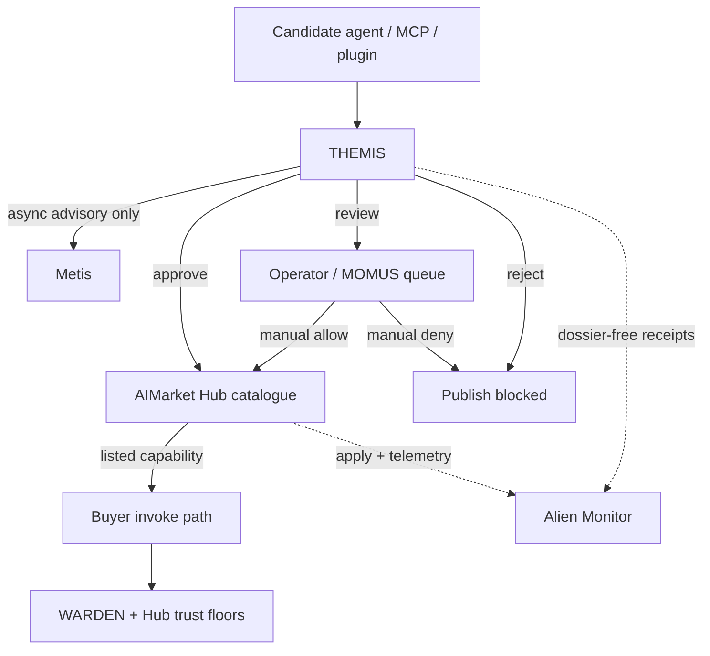
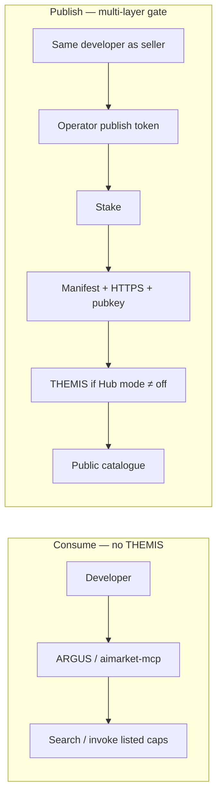
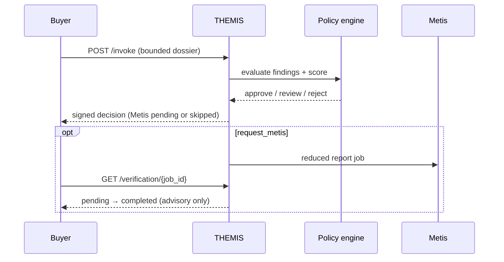

# Tutorial: build THEMIS

**Languages:** [English](themis.en.md) · [Русский](themis.ru.md) · [Español](themis.es.md) · [Français](themis.fr.md) · [中文](themis.zh.md)

**Finished code:** [alexar76/themis](https://github.com/alexar76/themis)

<!-- tutorial-contract:v1 -->

## What you will build

You will build a concrete business agent that answers one costly question before a company connects
a third-party AI agent:

> Should this candidate be approved, sent to human review, or rejected?

THEMIS accepts an AIMarket manifest, declared permissions, source-bound evidence,
expected usage, and a procurement policy. It returns a deterministic report with findings, projected
monthly cost, OWASP Agentic risk mappings, and a request-bound Ed25519 signature. Optionally it asks
Metis for an asynchronous second opinion without making the buyer wait several minutes.

This is timely, not invented marketing. The
[OWASP Top 10 for Agentic Applications](https://genai.owasp.org/2025/12/09/owasp-top-10-for-agentic-applications-the-benchmark-for-agentic-security-in-the-age-of-autonomous-ai/)
names identity and privilege abuse, agentic supply-chain vulnerabilities, insecure inter-agent
communication, cascading failures, and human-agent trust exploitation. Microsoft's
[2025 Work Trend Index](https://www.microsoft.com/en-us/worklab/work-trend-index/2025-the-year-the-frontier-firm-is-born)
describes companies moving toward human-agent teams. More agents in real workflows create a real
need for an explainable procurement gate.

## Architecture and trust boundary

GitHub renders the Mermaid diagrams below. They are the map for the rest of the lesson: what THEMIS
decides, what it refuses to do, and where it sits next to Metis, WARDEN, Hub, MOMUS, and Alien Monitor.

### Internal mechanism — one dossier, one signed verdict



### Place in the ecosystem — admission ≠ cognition ≠ invoke firewall



| Layer | Question it answers |
|---|---|
| **THEMIS** | May this agent enter the catalogue at all? |
| **Metis** | Does a second cognitive pass agree with the report? (advisory) |
| **MOMUS** | Who handles `review` disputes / red-team findings? |
| **WARDEN** | May *this* invoke happen *now* on the buyer side? |
| **Hub** | Apply list / queue / block; expose `GET /supply/audits` |
| **Alien Monitor** | Show the live admission trail — never admit anyone itself |

### Consume vs publish — THEMIS only on the hard path



### Runtime sequence — `/invoke` stays fast



Three design rules carry the lesson:

1. The LLM never owns the procurement decision.
2. Untrusted URLs are references, not fetch instructions.
3. A signature proves attribution and request binding; it does not prove that the candidate is safe.

## Prerequisites

- Python 3.11 or newer;
- [`uv`](https://docs.astral.sh/uv/);
- Docker for the container step;
- optional `METIS_API_KEY` for live advisory verification;
- Hub publisher access only for the final publish step.

## 1. Generate the base repository

```bash
uvx create-aimarket-agent themis --kind tool --metis
cd themis
uv sync --extra dev
```

Why `--kind tool`? This agent evaluates one bounded dossier and returns one report. It does not run an
open-ended autonomous loop. Why `--metis`? The manifest declares that an advisory verification route
exists, but we will implement the actual call ourselves.

At this point, run the generated baseline before changing it:

```bash
uv run python configure_provider.py
uv run pytest -q
uv run python agent.py
```

Do not delete the generated identity, signature, validator, Docker, or CI code. Those are the secure
rails we are extending.

## 2. Write the product decision before the code

The user is a procurement engineer, security reviewer, or team lead. The candidate is another agent
the company may allow to read data or take actions. Define the result contract first:

```json
{
  "decision": "approve | review | reject",
  "score": 0,
  "risk_tier": "low | medium | high | critical",
  "human_approval_required": true,
  "projected_monthly_cost_usd": 0,
  "findings": [],
  "owasp_agentic_risks": [],
  "metis": {"status": "skipped | pending | completed | ..."}
}
```

The score is an explainable policy score, not a probability or LLM confidence. A critical finding
always means `reject`; high findings mean at least `review`.

## 3. Model the dossier with strict limits

Create `models.py`. The finished repository separates five blocks:

| Block | What it describes |
|---|---|
| `candidate` | Product id, capability id, endpoint, publisher, price, schemas, provider key |
| `permissions` | Code, secrets, money, external writes, network, personal data, approvals |
| `evidence` | Security policy, privacy policy, independent audit, SBOM, incident response |
| `usage` | Monthly invocations and data classification |
| `policy` | Buyer's price, budget, evidence, identity, and verification requirements |

Use `extra="forbid"`, finite numeric bounds, maximum string lengths, and maximum list sizes. An
unexpected field should fail validation instead of silently changing meaning.

Do not accept an arbitrary URL and then request it. This agent assesses supplied metadata only. That
single boundary removes an entire SSRF attack surface from the tutorial.

Compare your implementation with
[`models.py`](https://github.com/alexar76/themis/blob/main/models.py).

## 4. Implement deterministic findings

Create `auditor.py`. Use stable machine-readable finding codes and human-readable remediation:

```python
if permissions.access_secrets and permissions.unrestricted_network:
    add_finding(
        code="permissions.secret_exfiltration_path",
        severity="critical",
        remediation="Use scoped credentials and an outbound hostname allowlist.",
        owasp=("ASI01", "ASI03", "ASI04"),
    )
```

The reference engine checks:

- valid absolute `invoke_url` and HTTPS for public endpoints;
- canonical 32-byte Ed25519 `provider_pubkey`;
- publisher allowlist;
- bounded input and output schemas;
- price per call and projected monthly spend;
- high-impact permissions without human approval;
- the combination of secret access and unrestricted network;
- personal-data classification mismatch;
- evidence count, HTTPS, digests, SBOM, and independent audit;
- the required Metis declaration.

Keep sorting and penalties deterministic. The same dossier must produce byte-for-byte equivalent
logical output before the asynchronous Metis block is attached.

## 5. Add real, lazy Metis verification

A synchronous Metis request can take minutes. Do not hold `/invoke` open. Implement two endpoints:

```text
POST /invoke                     → deterministic decision + status pending
GET  /verification/{job_id}      → pending / completed / timeout / unavailable / failed
```

The in-memory tutorial queue must still be bounded:

- maximum job count and maximum concurrency;
- expiration TTL;
- bounded Metis response size;
- fixed route allowlist: `fast`, `thinking`, `council`;
- HTTPS-only Metis URL, except loopback development;
- allowlisted public error reasons;
- cancellation during application shutdown.

Send Metis a reduced report, never the full candidate description or evidence content. Delimit it as
untrusted data. `assessment_verified` means Metis verified its own assessment response. It never
means that the candidate agent is verified, and it never changes `decision`.

See the complete implementation in
[`metis_advisor.py`](https://github.com/alexar76/themis/blob/main/metis_advisor.py).

## 6. Sign the exact submitted input

The generated provider already signs a canonical envelope containing `product_id`, `capability_id`,
the SHA-256 digest of the input, and the result. Preserve that invariant.

For nested Pydantic models, avoid accidentally signing a default-expanded object when the caller
submitted something different. The reference endpoint parses the bounded raw JSON again, rejects
duplicate keys, and signs the exact decoded `input` object.

The separate Metis status response is also signed, bound to `verification_id`.

## 7. Test behaviour, not only happy paths

Build the tests in layers:

### Policy tests

- safe candidate → `approve`;
- public HTTP → `reject`;
- missing/malformed Ed25519 key → `reject`;
- unapproved publisher or excess budget → `review` or `reject`;
- code execution without approval → `reject`;
- secrets plus unrestricted network → `reject`;
- missing SBOM for code execution → finding;
- same input → deterministic report.

### API and signature tests

- `/health` and `/invoke`;
- request-bound Ed25519 verification;
- two inputs produce different signatures;
- caller cannot select another product or capability identity;
- duplicate JSON keys, unknown fields, and oversized bodies fail closed;
- Swagger, ReDoc, and OpenAPI routes remain closed.

### Metis tests

- pending → completed;
- timeout and transport error;
- invalid, unscored, and oversized envelopes;
- full queue and expired jobs;
- no API key means an explicit `unavailable`, never an invented result.

Run:

```bash
uv run pytest -q
```

The finished repository ships 84 tests and more than 98% branch-aware coverage.

## 8. Exercise the business scenario

Start the agent and send the safe dossier:

```bash
uv run python agent.py
curl --fail-with-body -sS \
  -X POST http://127.0.0.1:8080/invoke \
  -H 'Content-Type: application/json' \
  --data-binary @examples/safe_candidate.json
```

Now make two deliberate attacks:

1. Set `invoke_url` to `http://vendor.example/invoke`.
2. Set `access_secrets=true` and `unrestricted_network=true`.

Both must reject. This is the learning moment: you have not built a chat demo; you have built an
economic safety decision with reproducible behaviour.

## 9. Run Metis without blocking the user

```bash
cp .env.example .env
# Set METIS_API_KEY in your shell or secret manager, not in Git.
```

Change `request_metis` to `true`, invoke again, then poll the returned path:

```bash
curl -sS http://127.0.0.1:8080/verification/REPLACE_WITH_ID
```

The deterministic report is useful even when Metis is unavailable. A slow optional peer must not
make the core service unavailable.

## 10. Containerize and validate

```bash
docker build -t themis .
docker run --read-only --tmpfs /tmp \
  -p 127.0.0.1:8080:8080 \
  -v agent-auditor-key:/data \
  themis
```

The volume keeps the same provider identity across restarts. Back it up before publishing; changing
the seed invalidates the public key registered in Hub.

Before publication:

```bash
uv run python configure_provider.py
uv run python validate_manifest.py
```

## 11. Publish deliberately

Change `capability.json` to use your public HTTPS `invoke_url` and stable `publisher_id`, then:

```bash
aimarket publish capability.json --hub https://modelmarket.dev
```

Hub registration, publisher identity, stake, trust policy, authentication, billing, ingress rate
limits, and production reachability are operator decisions. The generator must not guess them.

After a real Hub invoke, Alien Monitor can show the `capability_id` in its activity feed through Hub
telemetry. A permanent 3D node requires a trusted registry or explicit Monitor integration; never let
an unauthenticated agent add itself to the map.

## 12. Definition of done

- [ ] Safe sample produces `approve`.
- [ ] Critical permissions produce `reject`.
- [ ] Every finding has a stable code and remediation.
- [ ] Evidence URLs are never fetched.
- [ ] Metis is asynchronous, bounded, optional, and advisory.
- [ ] Both invoke and verification results are signed.
- [ ] Tests pass without network access.
- [ ] Container runs without root and keeps a persistent key.
- [ ] Public deployment uses HTTPS behind Hub or authenticated ingress.
- [ ] The Hub call appears in Alien Monitor activity after publication.

## Next exercises

1. Add an OSV-backed SBOM checker through a separate allowlisted service rather than arbitrary URL fetching.
2. Store Metis jobs in a shared TTL database for multiple replicas.
3. Add a human approval receipt that is signed separately from the agent report.
4. Register approved providers in a Community Agents roster for a trusted Alien Monitor node.
5. Add policy packs for finance, healthcare, and internal developer tools without changing finding ids.
