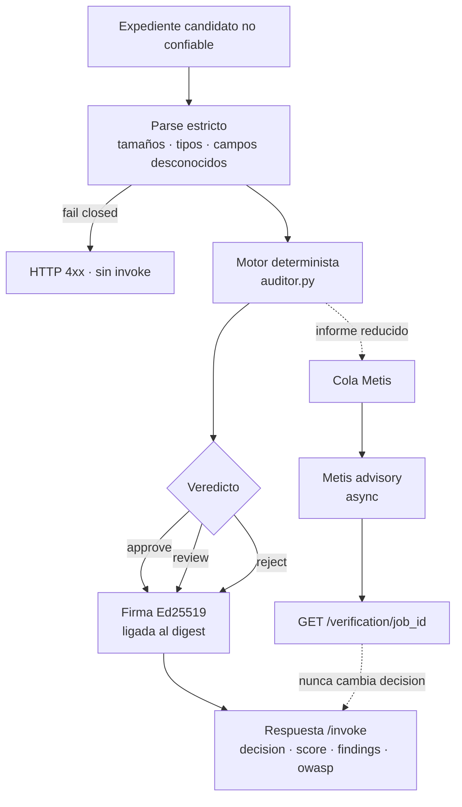
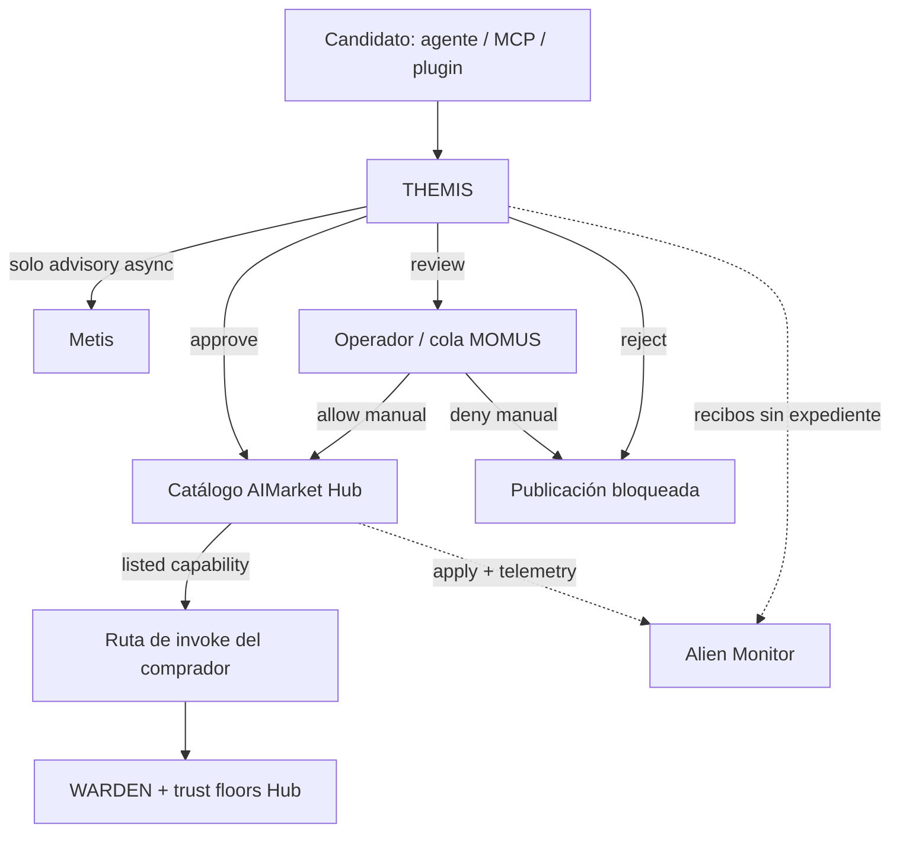
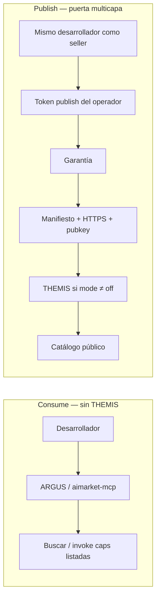
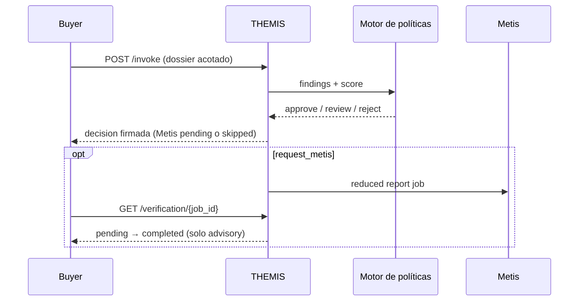

# Tutorial: crear THEMIS

**Idiomas:** [English](themis.en.md) · [Русский](themis.ru.md) · [Español](themis.es.md) · [Français](themis.fr.md) · [中文](themis.zh.md)

**Código terminado:** [alexar76/themis](https://github.com/alexar76/themis)

<!-- tutorial-contract:v1 -->

## Qué vamos a construir

Construiremos un agente útil para compras y seguridad que responde una pregunta costosa antes de
conectar un agente de IA de un tercero:

> ¿Debemos aprobar este candidato, enviarlo a revisión humana o rechazarlo?

THEMIS recibe un manifiesto AIMarket, permisos declarados, evidencia vinculada a
su fuente, uso previsto y una política de compra. Devuelve un informe determinista con hallazgos,
coste mensual proyectado, mapeo de riesgos OWASP Agentic y una firma Ed25519 ligada a la solicitud.
Opcionalmente pide a Metis una segunda opinión asíncrona sin obligar al comprador a esperar minutos.

El caso de uso es real: el OWASP Top 10 for Agentic Applications incluye abuso de identidad y
privilegios, vulnerabilidades de la cadena de suministro de agentes de IA, comunicación insegura entre
agentes, fallos en cascada y explotación de la confianza humano-agente. Cuantos más agentes actúan
en procesos empresariales, más importante es tener una puerta de compra explicable.

## Arquitectura y frontera de confianza

GitHub renderiza los diagramas Mermaid. Son el mapa del tutorial: qué decide THEMIS, qué rechaza
hacer, y dónde se sitúa junto a Metis, WARDEN, Hub, MOMUS y Alien Monitor.

### Mecanismo interno — un expediente, un veredicto firmado



### Lugar en el ecosistema — admisión ≠ cognición ≠ firewall de invoke



| Capa | Pregunta |
|---|---|
| **THEMIS** | ¿Puede este agente entrar al catálogo? |
| **Metis** | ¿Un segundo paso cognitivo concuerda? (advisory) |
| **MOMUS** | ¿Quién gestiona `review` / red team? |
| **WARDEN** | ¿Puede ocurrir *este* invoke *ahora*? |
| **Hub** | List / queue / block; `GET /supply/audits` |
| **Alien Monitor** | Mostrar el trail — no admite a nadie |

### Consume vs publish — THEMIS solo en el camino duro



### Secuencia en runtime — `/invoke` sigue siendo rápido



Tres reglas guían el diseño:

1. El LLM nunca toma la decisión de compra.
2. Las URL no confiables son referencias, no instrucciones para descargar contenido.
3. Una firma demuestra autoría y vinculación con la solicitud; no demuestra que el candidato sea seguro.

## Requisitos

- Python 3.11 o posterior;
- [`uv`](https://docs.astral.sh/uv/);
- Docker para el paso del contenedor;
- `METIS_API_KEY` opcional para la verificación consultiva real;
- acceso de proveedor a Hub únicamente para la publicación final.

## 1. Generar el repositorio base

```bash
uvx create-aimarket-agent themis --kind tool --metis
cd themis
uv sync --extra dev
```

Usamos `--kind tool` porque el agente evalúa un expediente acotado y devuelve un informe; no ejecuta
un bucle autónomo indefinido. `--metis` declara la ruta consultiva de verificación, que implementaremos
de forma explícita.

Primero comprueba la plantilla sin modificarla:

```bash
uv run python configure_provider.py
uv run pytest -q
uv run python agent.py
```

Conserva la identidad generada, la firma, el validador, Docker y CI: son las garantías que vamos a
extender.

## 2. Definir la decisión de producto antes del código

La persona usuaria es responsable de compras, seguridad o de un equipo. El candidato es otro agente
que quizá pueda leer datos o ejecutar acciones. Define primero el contrato de salida:

```json
{
  "decision": "approve | review | reject",
  "score": 0,
  "risk_tier": "low | medium | high | critical",
  "human_approval_required": true,
  "projected_monthly_cost_usd": 0,
  "findings": [],
  "owasp_agentic_risks": [],
  "metis": {"status": "skipped | pending | completed | ..."}
}
```

La puntuación es una medida explicable de la política, no una probabilidad ni la confianza de un
LLM. Un hallazgo crítico siempre produce `reject`; uno de gravedad alta exige al menos `review`.

## 3. Modelar el expediente con límites estrictos

Crea `models.py` y separa cinco bloques:

| Bloque | Contenido |
|---|---|
| `candidate` | Producto, capability, endpoint, proveedor, precio, esquemas y clave pública |
| `permissions` | Código, secretos, dinero, escrituras externas, red, datos personales y aprobaciones |
| `evidence` | Política de seguridad y privacidad, auditoría independiente, SBOM, respuesta a incidentes |
| `usage` | Número mensual de invocaciones (invoke) y clasificación de datos |
| `policy` | Límites del comprador para precio, presupuesto, identidad, evidencia y verificación |

Configura `extra="forbid"`, números finitos, longitudes máximas y listas acotadas. Un campo inesperado
debe provocar un error en vez de cambiar silenciosamente el significado.

No descargues una URL arbitraria aportada por el cliente. Este agente evalúa metadatos y referencias;
así evita convertirse en un proxy SSRF.

Compara tu solución con [`models.py`](https://github.com/alexar76/themis/blob/main/models.py).

## 4. Implementar hallazgos deterministas

Crea `auditor.py`. Cada hallazgo necesita un código estable, gravedad y corrección concreta:

```python
if permissions.access_secrets and permissions.unrestricted_network:
    add_finding(
        code="permissions.secret_exfiltration_path",
        severity="critical",
        remediation="Use scoped credentials and an outbound hostname allowlist.",
        owasp=("ASI01", "ASI03", "ASI04"),
    )
```

El motor de referencia comprueba:

- `invoke_url` absoluta y HTTPS para endpoints públicos;
- `provider_pubkey` Ed25519 canónica de 32 bytes;
- lista permitida de proveedores;
- esquemas de entrada y salida acotados;
- precio por llamada y gasto mensual proyectado;
- permisos de alto impacto sin aprobación humana;
- acceso a secretos combinado con red sin restricciones;
- clasificación incorrecta de datos personales;
- cantidad de evidencia, HTTPS, hashes, SBOM y auditoría independiente;
- declaración de Metis exigida por la política.

Ordena hallazgos y penalizaciones de forma determinista. El mismo expediente debe producir el mismo
informe antes de añadir el bloque asíncrono de Metis.

## 5. Añadir una verificación Metis real y perezosa

Una solicitud síncrona a Metis puede tardar minutos. No mantengas `/invoke` bloqueado:

```text
POST /invoke                     → decisión inmediata + status pending
GET  /verification/{job_id}      → pending / completed / timeout / unavailable / failed
```

La cola didáctica en memoria debe tener límites reales:

- número máximo de jobs y concurrencia máxima;
- TTL de expiración;
- tamaño máximo de la respuesta de Metis;
- rutas permitidas: `fast`, `thinking`, `council`;
- URL de Metis solo con HTTPS, salvo loopback local;
- razones de error públicas incluidas en una allowlist;
- cancelación ordenada al apagar el servicio.

Envía a Metis solo el informe reducido, nunca la descripción libre ni el contenido de la evidencia.
Márcalo como datos no confiables. `assessment_verified` indica que Metis verificó su propia respuesta,
no que haya certificado al agente candidato. Metis nunca cambia `decision`.

Consulta [`metis_advisor.py`](https://github.com/alexar76/themis/blob/main/metis_advisor.py).

## 6. Firmar exactamente la entrada recibida

El proveedor generado firma un sobre canónico con `product_id`, `capability_id`, el SHA-256 de la
entrada y el resultado. Mantén ese invariante.

No firmes por accidente el objeto expandido con valores predeterminados de Pydantic. El endpoint de
referencia vuelve a leer el JSON acotado, rechaza claves duplicadas y firma el objeto `input` exacto.
La respuesta de estado Metis también se firma y se vincula a `verification_id`.

## 7. Probar comportamiento y fallos

### Política

- candidato seguro → `approve`;
- HTTP público → `reject`;
- clave Ed25519 ausente o inválida → `reject`;
- proveedor no aprobado o presupuesto excedido → `review` o `reject`;
- ejecución de código sin aprobación → `reject`;
- secretos más red sin restricciones → `reject`;
- ejecución de código sin SBOM → hallazgo;
- misma entrada → mismo informe determinista.

### API y firma

- `/health` y `/invoke`;
- comprobación Ed25519 vinculada a la solicitud;
- dos entradas producen firmas distintas;
- el cliente no puede elegir otra identidad de producto o capability;
- claves JSON duplicadas, campos desconocidos y cuerpos grandes fallan en modo seguro;
- Swagger, ReDoc y OpenAPI permanecen cerrados.

### Metis

- transición `pending` → `completed`;
- timeout y error de transporte;
- respuestas inválidas, sin puntuación o demasiado grandes;
- límites de jobs y concurrencia, más expiración;
- sin API key se devuelve `unavailable`, nunca un resultado inventado.

Ejecuta:

```bash
uv run pytest -q
```

El repositorio terminado supera el 98 % de cobertura con ramas.

## 8. Probar el caso empresarial

```bash
uv run python agent.py
curl --fail-with-body -sS \
  -X POST http://127.0.0.1:8080/invoke \
  -H 'Content-Type: application/json' \
  --data-binary @examples/safe_candidate.json
```

La muestra segura debe devolver `approve`. Después simula dos ataques:

1. Cambia `invoke_url` a `http://vendor.example/invoke`.
2. Activa `access_secrets=true` y `unrestricted_network=true`.

Ambos deben terminar en `reject`: no hemos creado solo una demo conversacional, sino una decisión
económica reproducible.

## 9. Usar Metis sin bloquear al usuario

```bash
cp .env.example .env
# Define METIS_API_KEY en el shell o gestor de secretos, nunca en Git.
```

Cambia `request_metis` a `true`, repite la invocación (invoke) y consulta la ruta devuelta:

```bash
curl -sS http://127.0.0.1:8080/verification/REPLACE_WITH_ID
```

El informe determinista sigue siendo útil si Metis no está disponible. Un servicio opcional lento no
debe tumbar la función principal.

## 10. Crear el contenedor y validar

```bash
docker build -t themis .
docker run --read-only --tmpfs /tmp \
  -p 127.0.0.1:8080:8080 \
  -v agent-auditor-key:/data \
  themis
```

El volumen conserva la identidad del proveedor entre reinicios. Antes de publicar, ejecuta:

```bash
uv run python configure_provider.py
uv run python validate_manifest.py
```

## 11. Publicar de forma deliberada

Configura en `capability.json` tu `invoke_url` HTTPS pública y un `publisher_id` estable:

```bash
aimarket publish capability.json --hub https://modelmarket.dev
```

El registro en Hub, identidad, stake, confianza, autenticación, facturación, rate limits y alcance de
producción son decisiones del operador; el generador no debe inventarlas.

Tras una invocación real a través de Hub, Alien Monitor puede mostrar `capability_id` en el flujo de
actividad mediante telemetría de Hub. Un nodo 3D permanente necesita un registro confiable o una
integración explícita con Monitor; un agente anónimo nunca debe añadirse por sí mismo.

## 12. Criterios de finalización

- [ ] La muestra segura produce `approve`.
- [ ] Los permisos críticos producen `reject`.
- [ ] Cada hallazgo tiene código estable y corrección.
- [ ] Las URL de evidencia nunca se descargan.
- [ ] Metis es asíncrono, acotado, opcional y consultivo.
- [ ] Los resultados de invocación y verificación están firmados.
- [ ] Los tests pasan sin acceso a Internet.
- [ ] El contenedor no usa root y conserva una clave persistente.
- [ ] La producción usa HTTPS detrás de Hub o de un ingress autenticado.
- [ ] La llamada de Hub aparece en la actividad de Alien Monitor después de publicar.

## Próximos ejercicios

1. Añade un verificador de SBOM basado en OSV mediante un servicio separado con allowlist.
2. Guarda los jobs de Metis en un almacén TTL compartido para varias réplicas.
3. Añade un recibo de aprobación humana con su propia firma.
4. Registra proveedores aprobados en Community Agents para un nodo confiable de Alien Monitor.
5. Crea paquetes de políticas para finanzas, salud y herramientas internas sin cambiar los códigos de hallazgo.
