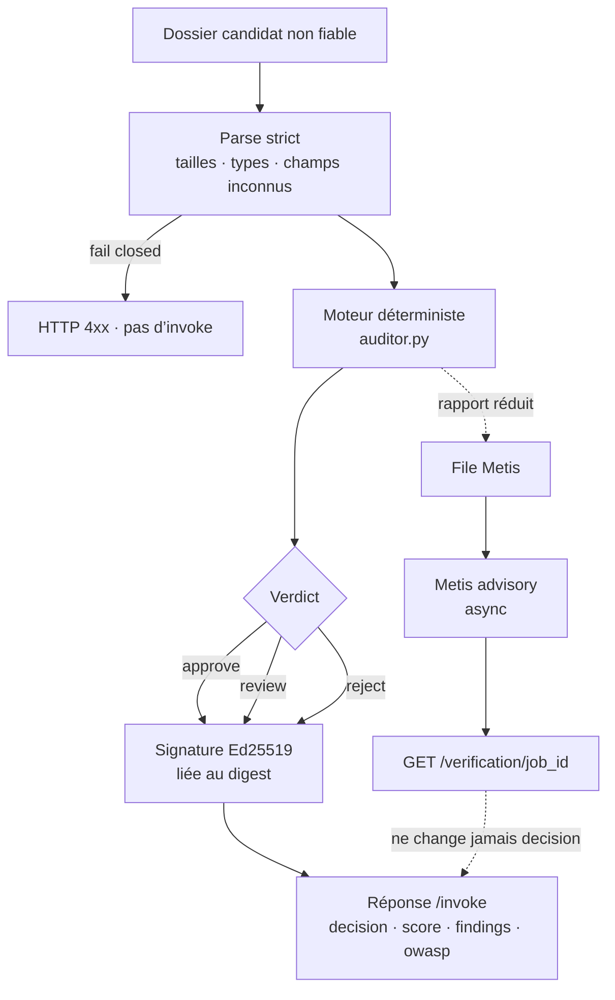
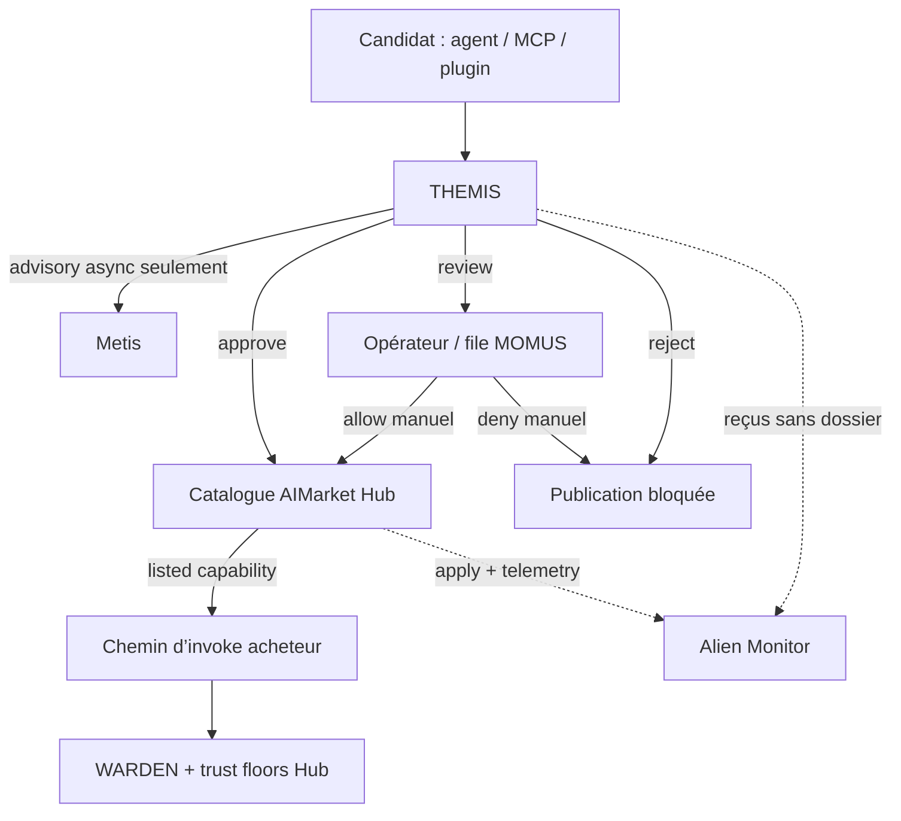
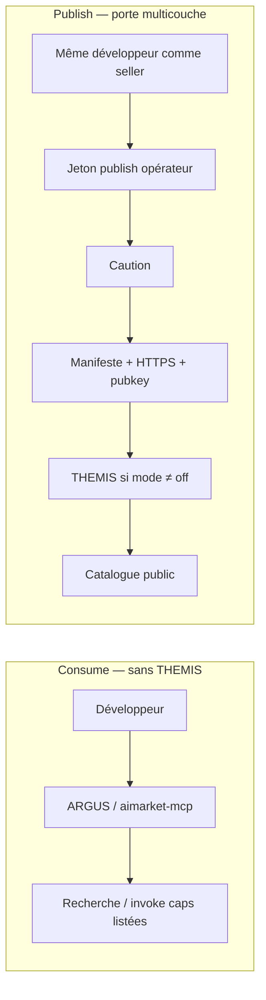
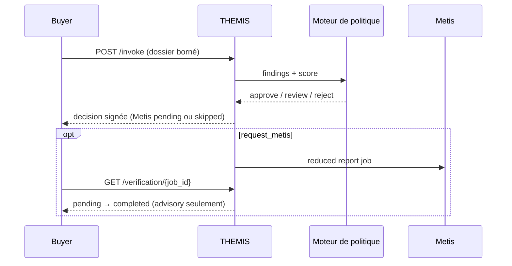

# Tutoriel : créer THEMIS

**Langues :** [English](themis.en.md) · [Русский](themis.ru.md) · [Español](themis.es.md) · [Français](themis.fr.md) · [中文](themis.zh.md)

**Code final :** [alexar76/themis](https://github.com/alexar76/themis)

<!-- tutorial-contract:v1 -->

## Ce que nous allons construire

Nous allons créer un agent utile aux équipes achats et sécurité. Avant qu'une entreprise connecte
un agent IA tiers, il répond à une question coûteuse :

> Faut-il approuver ce candidat, demander une revue humaine ou le rejeter ?

THEMIS reçoit un manifeste AIMarket, des permissions déclarées, des preuves
liées à leur source, un usage prévu et une politique d'achat. Il renvoie un rapport déterministe :
constats, coût mensuel projeté, correspondances OWASP Agentic et signature Ed25519 liée à la requête.
Il peut aussi demander à Metis un second avis asynchrone sans faire attendre l'acheteur plusieurs
minutes.

Le besoin est concret. L'OWASP Top 10 for Agentic Applications couvre notamment l'abus d'identité
et de privilèges, les vulnérabilités de la chaîne d'approvisionnement des agents IA, les communications
inter-agents non sécurisées, les défaillances en cascade et l'exploitation de la confiance humaine.
Plus les agents agissent dans l'entreprise, plus une porte d'achat explicable devient importante.

## Architecture et frontière de confiance

GitHub affiche les diagrammes Mermaid. C’est la carte du tutoriel : ce que THEMIS décide, ce qu’il
refuse de faire, et sa place à côté de Metis, WARDEN, Hub, MOMUS et Alien Monitor.

### Mécanisme interne — un dossier, un verdict signé



### Place dans l’écosystème — admission ≠ cognition ≠ pare-feu d’invoke



| Couche | Question |
|---|---|
| **THEMIS** | Cet agent peut-il entrer dans le catalogue ? |
| **Metis** | Un second passage cognitif est-il d’accord ? (advisory) |
| **MOMUS** | Qui traite les `review` / red team ? |
| **WARDEN** | Cet invoke peut-il avoir lieu *maintenant* ? |
| **Hub** | List / queue / block ; `GET /supply/audits` |
| **Alien Monitor** | Afficher le trail — n’admet personne |

### Consume vs publish — THEMIS seulement sur le chemin dur



### Séquence runtime — `/invoke` reste rapide



Trois règles structurent la solution :

1. Le LLM ne prend jamais la décision d'achat.
2. Une URL non fiable est une référence, jamais une instruction de téléchargement.
3. Une signature prouve l'attribution et le lien avec la requête, pas la sûreté du candidat.

## Prérequis

- Python 3.11 ou plus récent ;
- [`uv`](https://docs.astral.sh/uv/) ;
- Docker pour l'étape conteneur ;
- `METIS_API_KEY` facultative pour une vérification consultative réelle ;
- accès fournisseur à Hub uniquement pour la publication finale.

## 1. Générer le dépôt de base

```bash
uvx create-aimarket-agent themis --kind tool --metis
cd themis
uv sync --extra dev
```

Nous choisissons `--kind tool` car l'agent évalue un dossier borné et renvoie un rapport ; il ne lance
pas une boucle autonome ouverte. `--metis` déclare une route de vérification consultative, que nous
allons implémenter explicitement.

Testez d'abord le squelette sans le modifier :

```bash
uv run python configure_provider.py
uv run pytest -q
uv run python agent.py
```

Conservez l'identité, la signature, le validateur, Docker et la CI générés : ce sont les garde-fous
que nous allons étendre.

## 2. Définir la décision produit avant le code

L'utilisateur est responsable des achats, de la sécurité ou d'une équipe. Le candidat est un autre
agent auquel l'entreprise envisage de confier des données ou des actions. Définissez d'abord le
contrat de sortie :

```json
{
  "decision": "approve | review | reject",
  "score": 0,
  "risk_tier": "low | medium | high | critical",
  "human_approval_required": true,
  "projected_monthly_cost_usd": 0,
  "findings": [],
  "owasp_agentic_risks": [],
  "metis": {"status": "skipped | pending | completed | ..."}
}
```

Le score mesure une politique explicable ; ce n'est ni une probabilité ni la confiance d'un LLM.
Un constat critique produit toujours `reject`, un constat élevé impose au minimum `review`.

## 3. Modéliser le dossier avec des limites strictes

Créez `models.py` et séparez cinq blocs :

| Bloc | Contenu |
|---|---|
| `candidate` | Produit, capability, endpoint, fournisseur, prix, schémas et clé publique |
| `permissions` | Code, secrets, argent, écritures externes, réseau, données personnelles, approbations |
| `evidence` | Politique sécurité/vie privée, audit indépendant, SBOM, réponse aux incidents |
| `usage` | Nombre mensuel d'invocations et classification des données |
| `policy` | Limites d'achat : prix, budget, identité, preuves et vérification |

Utilisez `extra="forbid"`, des nombres finis, des longueurs maximales et des listes bornées. Un champ
inattendu doit faire échouer la validation au lieu de changer silencieusement le sens.

Ne téléchargez jamais une URL arbitraire fournie par le client. Cet agent évalue des métadonnées et
des références ; cette frontière élimine une surface d'attaque SSRF complète.

Comparez avec [`models.py`](https://github.com/alexar76/themis/blob/main/models.py).

## 4. Implémenter des constats déterministes

Créez `auditor.py`. Chaque constat porte un code stable, une sévérité et une correction concrète :

```python
if permissions.access_secrets and permissions.unrestricted_network:
    add_finding(
        code="permissions.secret_exfiltration_path",
        severity="critical",
        remediation="Use scoped credentials and an outbound hostname allowlist.",
        owasp=("ASI01", "ASI03", "ASI04"),
    )
```

Le moteur de référence vérifie :

- une `invoke_url` absolue et HTTPS pour les endpoints publics ;
- une `provider_pubkey` Ed25519 canonique de 32 octets ;
- l'allowlist des fournisseurs ;
- les schémas d'entrée et de sortie bornés ;
- le prix par appel et la dépense mensuelle projetée ;
- les permissions à fort impact sans approbation humaine ;
- l'accès aux secrets combiné à un réseau sans restriction ;
- une classification incohérente des données personnelles ;
- le nombre de preuves, HTTPS, les empreintes, le SBOM et l'audit indépendant ;
- la déclaration Metis exigée par la politique.

Le tri et les pénalités doivent être déterministes. Le même dossier produit le même rapport avant
l'ajout du bloc Metis asynchrone.

## 5. Ajouter une vérification Metis réelle et différée

Une requête synchrone à Metis peut durer plusieurs minutes. Ne bloquez pas `/invoke` :

```text
POST /invoke                     → décision immédiate + status pending
GET  /verification/{job_id}      → pending / completed / timeout / unavailable / failed
```

Même la file pédagogique en mémoire doit être bornée :

- nombre total de jobs et concurrence maximale ;
- TTL d'expiration ;
- taille maximale de réponse Metis ;
- routes autorisées : `fast`, `thinking`, `council` ;
- URL Metis en HTTPS, sauf loopback local ;
- raisons d'erreur publiques placées sur allowlist ;
- annulation propre lors de l'arrêt.

Envoyez seulement un rapport réduit à Metis, jamais la description libre ni le contenu des preuves.
Délimitez-le comme données non fiables. `assessment_verified` signifie que Metis a vérifié sa propre
réponse ; cela ne certifie pas l'agent candidat et ne change jamais `decision`.

Consultez [`metis_advisor.py`](https://github.com/alexar76/themis/blob/main/metis_advisor.py).

## 6. Signer exactement l'entrée reçue

Le fournisseur généré signe une enveloppe canonique contenant `product_id`, `capability_id`, le
SHA-256 de l'entrée et le résultat. Préservez cet invariant.

Ne signez pas par erreur un modèle Pydantic enrichi de valeurs par défaut. L'endpoint de référence
relit le JSON borné, refuse les clés dupliquées et signe l'objet `input` exact. La réponse de statut
Metis est aussi signée et liée à `verification_id`.

## 7. Tester les comportements et les échecs

### Politique

- candidat sûr → `approve` ;
- HTTP public → `reject` ;
- clé Ed25519 absente ou incorrecte → `reject` ;
- fournisseur non approuvé ou budget dépassé → `review` ou `reject` ;
- exécution de code sans approbation → `reject` ;
- secrets plus réseau sans restriction → `reject` ;
- exécution de code sans SBOM → constat ;
- même entrée → même rapport déterministe.

### API et signature

- `/health` et `/invoke` ;
- vérification Ed25519 liée à la requête ;
- deux entrées donnent des signatures différentes ;
- l'appelant ne peut pas choisir une autre identité de produit ou capability ;
- clés JSON dupliquées, champs inconnus et corps trop grands échouent de façon sûre ;
- Swagger, ReDoc et OpenAPI restent désactivés.

### Metis

- transition `pending` → `completed` ;
- timeout et panne de transport ;
- enveloppes invalides, sans score ou trop grandes ;
- jobs, concurrence et expiration bornés ;
- sans clé API, retour explicite `unavailable`, jamais un résultat inventé.

Exécutez :

```bash
uv run pytest -q
```

Le dépôt final dépasse 98 % de couverture avec analyse des branches.

## 8. Jouer le scénario métier

```bash
uv run python agent.py
curl --fail-with-body -sS \
  -X POST http://127.0.0.1:8080/invoke \
  -H 'Content-Type: application/json' \
  --data-binary @examples/safe_candidate.json
```

L'exemple sûr doit produire `approve`. Simulez ensuite deux attaques :

1. Remplacez `invoke_url` par `http://vendor.example/invoke`.
2. Activez `access_secrets=true` et `unrestricted_network=true`.

Les deux doivent produire `reject`. Vous avez construit une décision économique reproductible, pas
seulement une démonstration conversationnelle.

## 9. Utiliser Metis sans bloquer l'utilisateur

```bash
cp .env.example .env
# Définissez METIS_API_KEY dans le shell ou le gestionnaire de secrets, jamais dans Git.
```

Passez `request_metis` à `true`, relancez l'invocation puis consultez le chemin reçu :

```bash
curl -sS http://127.0.0.1:8080/verification/REPLACE_WITH_ID
```

Le rapport déterministe reste utile si Metis est indisponible. Un pair optionnel lent ne doit jamais
rendre le service principal indisponible.

## 10. Construire le conteneur et valider

```bash
docker build -t themis .
docker run --read-only --tmpfs /tmp \
  -p 127.0.0.1:8080:8080 \
  -v agent-auditor-key:/data \
  themis
```

Le volume conserve l'identité du fournisseur entre les redémarrages. Avant la publication :

```bash
uv run python configure_provider.py
uv run python validate_manifest.py
```

## 11. Publier délibérément

Placez votre `invoke_url` HTTPS publique et un `publisher_id` stable dans `capability.json` :

```bash
aimarket publish capability.json --hub https://modelmarket.dev
```

L'inscription dans Hub, l'identité, le stake, la politique de confiance, l'authentification, la
facturation, les rate limits et l'accessibilité de production relèvent de l'opérateur. Le générateur
ne doit pas les deviner.

Après une invocation réelle via Hub, Alien Monitor peut afficher `capability_id` dans son flux
d'activité grâce à la télémétrie Hub. Un nœud 3D permanent exige un registre fiable ou une intégration
explicite avec Monitor ; un agent non authentifié ne doit jamais s'ajouter lui-même.

## 12. Définition de terminé

- [ ] L'exemple sûr produit `approve`.
- [ ] Les permissions critiques produisent `reject`.
- [ ] Chaque constat possède un code stable et une correction.
- [ ] Les URL de preuves ne sont jamais téléchargées.
- [ ] Metis est asynchrone, borné, facultatif et consultatif.
- [ ] Les résultats d'invocation et de vérification sont signés.
- [ ] Les tests passent sans accès réseau.
- [ ] Le conteneur s'exécute sans root et conserve une clé persistante.
- [ ] La production utilise HTTPS derrière Hub ou un ingress authentifié.
- [ ] L'appel Hub apparaît dans l'activité d'Alien Monitor après publication.

## Exercices suivants

1. Ajoutez une vérification SBOM fondée sur OSV via un service séparé et placé sur allowlist.
2. Stockez les jobs Metis dans un magasin TTL partagé entre plusieurs réplicas.
3. Ajoutez un reçu d'approbation humaine avec une signature distincte.
4. Inscrivez les fournisseurs approuvés dans Community Agents pour un nœud Alien Monitor fiable.
5. Créez des packs de politiques finance, santé et outils internes sans modifier les codes de constat.
