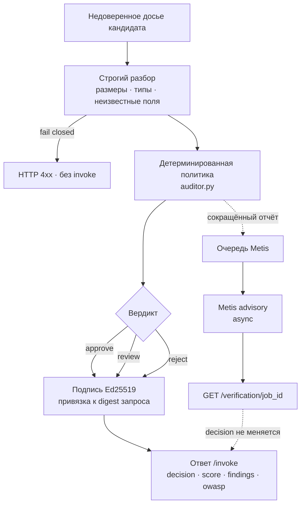
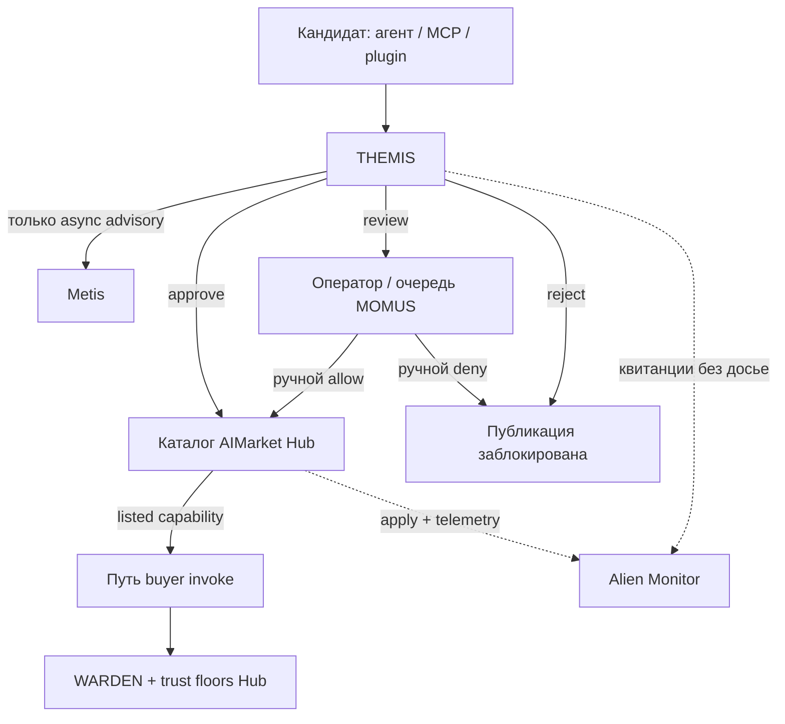
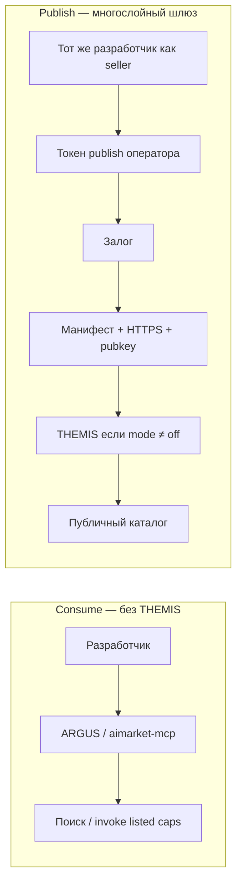
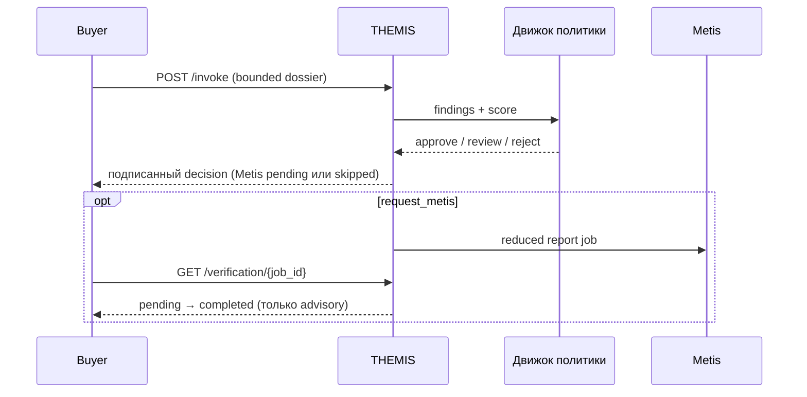

# Урок: создаём THEMIS

**Языки:** [English](themis.en.md) · [Русский](themis.ru.md) · [Español](themis.es.md) · [Français](themis.fr.md) · [中文](themis.zh.md)

**Готовый код:** [alexar76/themis](https://github.com/alexar76/themis)

<!-- tutorial-contract:v1 -->

## Что мы создадим

Мы разработаем конкретного бизнес-агента, который до подключения стороннего AI-агента отвечает на
дорогой практический вопрос:

> Кандидата можно одобрить, нужно отправить на проверку человеку или следует отклонить?

THEMIS принимает манифест AIMarket, заявленные полномочия, привязанные к source
доказательства, ожидаемую нагрузку и политику закупки. Он возвращает детерминированный отчёт с
находками, прогнозом месячных расходов, сопоставлением с OWASP Agentic и привязанной к запросу
подписью Ed25519. При необходимости Metis асинхронно даёт второе мнение, не заставляя пользователя
ждать несколько минут.

Идея опирается на реальное использование терминов. OWASP Agentic Top 10 описывает злоупотребление
идентичностью и привилегиями, уязвимости цепочки поставок AI-агентов, небезопасное межагентное
взаимодействие, каскадные сбои и эксплуатацию доверия человека к агенту. Microsoft Work Trend Index
описывает переход бизнеса к смешанным командам людей и агентов.

## Архитектура и граница доверия

Диаграммы Mermaid ниже рисует GitHub. Это карта урока: что решает THEMIS, чего он не делает, и где
он стоит рядом с Metis, WARDEN, Hub, MOMUS и Alien Monitor.

### Внутренний механизм — одно досье, один подписанный вердикт



### Место в экосистеме — допуск ≠ познание ≠ firewall на invoke



| Слой | Вопрос |
|---|---|
| **THEMIS** | Можно ли вообще пускать агента в каталог? |
| **Metis** | Согласен ли когнитивный второй проход с отчётом? (advisory) |
| **MOMUS** | Кто разбирает `review` / red-team? |
| **WARDEN** | Можно ли *этот* invoke *сейчас* у покупателя? |
| **Hub** | List / queue / block; `GET /supply/audits` |
| **Alien Monitor** | Показать trail допуска — сам никого не допускает |

### Consume vs publish — THEMIS только на жёстком пути



### Runtime sequence — `/invoke` остаётся быстрым



Главные правила:

1. LLM никогда не принимает решение о закупке.
2. Недоверенные URL — это ссылки, а не команды на загрузку.
3. Подпись доказывает атрибуцию и привязку к запросу, но не безопасность кандидата.

## Требования

- Python 3.11+;
- `uv`;
- Docker для контейнерного шага;
- необязательный `METIS_API_KEY`;
- доступ поставщика к Hub только для финальной публикации.

## 1. Создайте базовый репозиторий

```bash
uvx create-aimarket-agent themis --kind tool --metis
cd themis
uv sync --extra dev
```

`--kind tool` выбран потому, что агент анализирует одно ограниченное досье и возвращает один отчёт,
а не выполняет открытый автономный цикл. `--metis` объявляет маршрут верификации, реальную интеграцию
мы добавим сами.

До изменений проверьте исходный каркас:

```bash
uv run python configure_provider.py
uv run pytest -q
uv run python agent.py
```

Не удаляйте генерацию идентичности, подпись, валидатор, Docker и CI: это безопасные рельсы проекта.

## 2. Сначала опишите продуктовое решение

Пользователь — специалист по закупкам, безопасности или руководитель команды. Результат задаём до
кода:

```json
{
  "decision": "approve | review | reject",
  "score": 0,
  "risk_tier": "low | medium | high | critical",
  "human_approval_required": true,
  "projected_monthly_cost_usd": 0,
  "findings": [],
  "owasp_agentic_risks": [],
  "metis": {"status": "skipped | pending | completed | ..."}
}
```

`score` — объяснимая оценка политики, а не вероятность и не confidence LLM. Critical-находка всегда
означает `reject`, high-находка требует как минимум `review`.

## 3. Задайте строго ограниченное досье

Создайте `models.py` и разделите input на пять блоков:

| Блок | Что описывает |
|---|---|
| `candidate` | product id, capability id, endpoint, publisher, цена, schemas и ключ поставщика |
| `permissions` | Код, секреты, деньги, внешняя запись, сеть, персональные данные, approvals |
| `evidence` | Политики, независимый аудит, SBOM, incident response |
| `usage` | Месячные вызовы (invoke) и классификация данных |
| `policy` | Ограничения покупателя по цене, бюджету, evidence, идентичности и верификации |

Используйте `extra="forbid"`, конечные числовые диапазоны, максимальные длины строк и списков.
Неизвестное поле должно завершать запрос ошибкой.

Никогда не загружайте произвольный URL из досье. Этот агент анализирует переданные метаданные и не
превращается в SSRF-прокси.

Сверьтесь с [`models.py`](https://github.com/alexar76/themis/blob/main/models.py).

## 4. Реализуйте детерминированные находки

В `auditor.py` используйте стабильные коды и понятные исправления:

```python
if permissions.access_secrets and permissions.unrestricted_network:
    add_finding(
        code="permissions.secret_exfiltration_path",
        severity="critical",
        remediation="Use scoped credentials and an outbound hostname allowlist.",
        owasp=("ASI01", "ASI03", "ASI04"),
    )
```

Проверяйте HTTPS, Ed25519 `provider_pubkey`, allowlist издателей, input/output schemas, цену и
месячный бюджет, опасные полномочия без участия человека, сочетание секретов с открытой сетью,
классификацию персональных данных, количество evidence, дайджесты, SBOM и объявление Metis.

Сортировка и штрафы должны быть детерминированными: одно досье даёт один и тот же логический отчёт.

## 5. Подключите настоящий ленивый Metis

Синхронный ответ Metis может занять минуты. Не держите `/invoke` открытым:

```text
POST /invoke                → решение + status pending
GET /verification/{job_id}  → pending / completed / timeout / unavailable / failed
```

Ограничьте число jobs, параллельность, TTL, размер ответа, маршруты `fast/thinking/council`, URL Metis и публичные
причины ошибок. При shutdown отменяйте задачи.

Передавайте Metis только сокращённый отчёт без описания кандидата и содержимого evidence. Поле
`assessment_verified` означает верификацию собственного ответа Metis, а не кандидата. Metis не имеет
права менять `decision`.

Полный код: [`metis_advisor.py`](https://github.com/alexar76/themis/blob/main/metis_advisor.py).

## 6. Подпишите точный input

Сохраните инвариант генератора: канонический конверт включает `product_id`, `capability_id`,
SHA-256-дайджест input и результат. Для вложенных Pydantic-моделей не подписывайте незаметно
расширенный defaults-объект. Повторно разберите уже ограниченный raw JSON, отклоните повторяющиеся
ключи и подпишите точный декодированный `input`.

Ответ статуса Metis подписывается отдельно с привязкой к `verification_id`.

## 7. Покройте поведение тестами

Проверьте:

- безопасный кандидат → `approve`;
- публичный HTTP и неверный Ed25519-ключ → `reject`;
- превышение бюджета → `review` или `reject`;
- исполнение кода без человека → `reject`;
- секреты плюс unrestricted network → `reject`;
- отсутствие SBOM → находка;
- одинаковый input → одинаковый отчёт;
- криптографическую подпись и её привязку к input;
- подмену product/capability id;
- повторяющиеся JSON-ключи, неизвестные поля и большие тела;
- состояния Metis, полный queue и истёкший TTL;
- отсутствие сети во время unit-тестов.

```bash
uv run pytest -q
```

Готовый репозиторий содержит 84 теста и более 98% покрытия с ветвлениями.

## 8. Пройдите бизнес-сценарий

```bash
uv run python agent.py
curl --fail-with-body -sS \
  -X POST http://127.0.0.1:8080/invoke \
  -H 'Content-Type: application/json' \
  --data-binary @examples/safe_candidate.json
```

Затем проведите две атаки: укажите `http://vendor.example/invoke`; включите одновременно
`access_secrets=true` и `unrestricted_network=true`. Оба случая должны дать `reject`.

## 9. Проверьте Metis без ожидания

```bash
cp .env.example .env
# METIS_API_KEY задавайте в shell или secret manager, но не в Git.
```

Поставьте `request_metis: true`, повторите вызов и опрашивайте:

```bash
curl -sS http://127.0.0.1:8080/verification/REPLACE_WITH_ID
```

Основной отчёт остаётся полезным при недоступности Metis. Медленный необязательный пир не должен
выводить из строя основной сервис.

## 10. Соберите контейнер и проверьте манифест

```bash
docker build -t themis .
docker run --read-only --tmpfs /tmp \
  -p 127.0.0.1:8080:8080 \
  -v agent-auditor-key:/data \
  themis

uv run python configure_provider.py
uv run python validate_manifest.py
```

Volume сохраняет идентичность поставщика между рестартами. Сделайте резервную копию ключа до
публикации: его замена нарушит соответствие `provider_pubkey` в Hub.

## 11. Опубликуйте осознанно

Задайте публичный HTTPS `invoke_url` и стабильный `publisher_id`:

```bash
aimarket publish capability.json --hub https://modelmarket.dev
```

Идентичность, залог, политика доверия, аутентификация, биллинг, внешние rate limits и доступность —
решения оператора, их нельзя безопасно угадать в генераторе.

После реального вызова через Hub `capability_id` может появиться в ленте Alien Monitor через
телеметрию Hub. Постоянная 3D-нода требует доверенного реестра; недоверенный агент не должен добавлять
себя на карту напрямую.

## 12. Критерии готовности

- [ ] Безопасный пример даёт `approve`.
- [ ] Critical-полномочия дают `reject`.
- [ ] У каждой находки стабильный код и исправление.
- [ ] Evidence URL никогда не загружаются.
- [ ] Metis асинхронный, ограниченный, необязательный и advisory.
- [ ] Invoke и verification-ответы подписаны.
- [ ] Тесты проходят без сети.
- [ ] Контейнер работает без root и хранит постоянный ключ.
- [ ] Публичный сервис использует HTTPS за Hub или authenticated ingress.
- [ ] После публикации Hub-вызов появляется в активности Alien Monitor.

## Идеи для продолжения

1. Добавьте OSV-проверку SBOM через отдельный allowlisted service.
2. Перенесите jobs Metis в общий TTL-store для нескольких replicas.
3. Добавьте отдельную подписанную квитанцию человеческого approval.
4. Подключите одобренных поставщиков к доверенному Community Agents registry Alien Monitor.
5. Создайте policy packs для финансов, медицины и внутренних developer tools без изменения finding ids.
