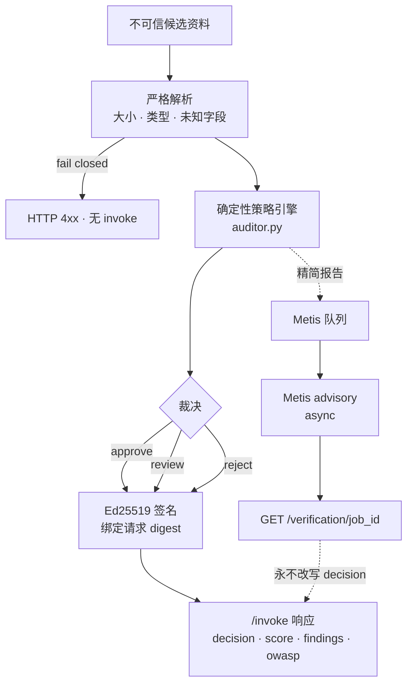
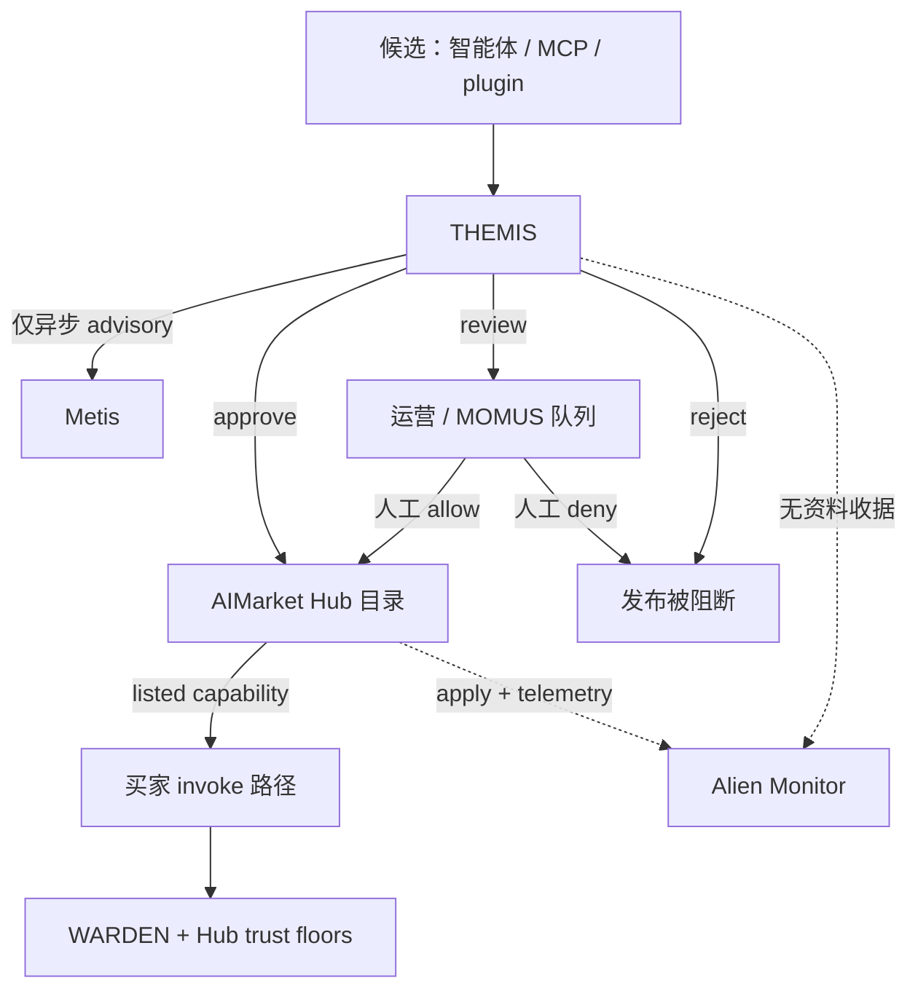
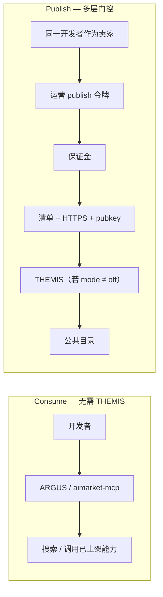
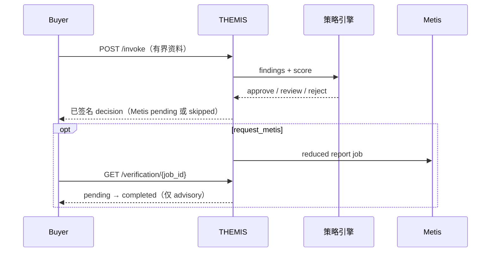

# 教程：构建 THEMIS

**语言：** [English](themis.en.md) · [Русский](themis.ru.md) · [Español](themis.es.md) · [Français](themis.fr.md) · [中文](themis.zh.md)

**完整代码：** [alexar76/themis](https://github.com/alexar76/themis)

<!-- tutorial-contract:v1 -->

## 我们要构建什么

我们将构建一个面向采购与安全团队的实用智能体。在企业连接第三方 AI 智能体之前，
它回答一个代价很高的问题：

> 应当批准该候选智能体、交给人工复核，还是拒绝它？

THEMIS 接收 AIMarket 清单、声明的权限、与来源绑定的证据、预计用量和
采购策略。它返回一份确定性报告，其中包含发现项、预计月度成本、OWASP Agentic 风险映射，
以及与请求绑定的 Ed25519 签名。它还可以异步请求 Metis 提供第二意见，而不让采购人员等待
数分钟。

这不是虚构的营销场景。OWASP Top 10 for Agentic Applications 已涵盖身份与权限滥用、
AI 智能体供应链漏洞、不安全的智能体间通信、级联故障和人机信任利用。进入真实业务流程的
智能体越多，企业就越需要一套可解释的采购门禁。

## 架构与信任边界

下方 Mermaid 图由 GitHub 渲染。它们是本教程的地图：THEMIS 决定什么、拒绝做什么，以及它与
Metis、WARDEN、Hub、MOMUS、Alien Monitor 的相对位置。

### 内部机制 — 一份资料，一份签名裁决



### 在生态中的位置 — 准入 ≠ 认知 ≠ 调用防火墙



| 层 | 回答的问题 |
|---|---|
| **THEMIS** | 该智能体能否进入目录？ |
| **Metis** | 第二次认知审查是否同意？（advisory） |
| **MOMUS** | 谁处理 `review` / 红队？ |
| **WARDEN** | *这次* invoke *现在* 是否允许？ |
| **Hub** | List / queue / block；`GET /supply/audits` |
| **Alien Monitor** | 展示准入轨迹 — 本身不接纳任何人 |

### Consume vs publish — THEMIS 只在硬路径上



### 运行时序列 — `/invoke` 保持快速



方案遵循三条规则：

1. LLM 永远不拥有采购决策权。
2. 不可信 URL 只是引用，不是下载指令。
3. 签名证明来源与请求绑定关系，但不证明候选智能体一定安全。

## 前置条件

- Python 3.11 或更高版本；
- [`uv`](https://docs.astral.sh/uv/)；
- Docker，用于容器步骤；
- 可选的 `METIS_API_KEY`，用于真实的咨询式验证；
- 仅在最终发布时才需要 Hub 提供方权限。

## 1. 生成基础仓库

```bash
uvx create-aimarket-agent themis --kind tool --metis
cd themis
uv sync --extra dev
```

选择 `--kind tool`，是因为该智能体只评估一个有边界的资料包并返回一份报告，而不是运行
开放式自主循环。`--metis` 声明存在咨询式验证路径，实际调用由我们明确实现。

修改之前先运行生成的基线：

```bash
uv run python configure_provider.py
uv run pytest -q
uv run python agent.py
```

不要删除生成的身份、签名、校验器、Docker 或 CI 代码；这些是我们要继续扩展的安全护栏。

## 2. 先定义产品决策，再写代码

使用者可能是采购工程师、安全评审人员或团队负责人。候选对象是企业准备授权读取数据或
执行操作的另一个智能体。先定义结果契约：

```json
{
  "decision": "approve | review | reject",
  "score": 0,
  "risk_tier": "low | medium | high | critical",
  "human_approval_required": true,
  "projected_monthly_cost_usd": 0,
  "findings": [],
  "owasp_agentic_risks": [],
  "metis": {"status": "skipped | pending | completed | ..."}
}
```

`score` 是可解释的策略分数，不是概率，也不是 LLM 置信度。任何 critical 发现项都必须
产生 `reject`；high 发现项至少产生 `review`。

## 3. 使用严格边界建模资料包

创建 `models.py`，将输入分成五个区块：

| 区块 | 含义 |
|---|---|
| `candidate` | 产品、capability、endpoint、提供方、价格、schema 与公钥 |
| `permissions` | 代码、密钥、资金、外部写入、网络、个人数据与人工批准 |
| `evidence` | 安全/隐私策略、独立审计、SBOM、事件响应 |
| `usage` | 每月调用（invoke）次数与数据分类 |
| `policy` | 买方对价格、预算、身份、证据和验证的要求 |

设置 `extra="forbid"`、有限数值范围、最大字符串长度和最大列表长度。遇到未知字段时应
拒绝请求，而不是静默改变含义。

不要访问客户端提供的任意 URL。该智能体只评估元数据和引用；这条边界直接消除了将服务
变成 SSRF 代理的风险。

请与 [`models.py`](https://github.com/alexar76/themis/blob/main/models.py) 对照。

## 4. 实现确定性的发现项

创建 `auditor.py`。每个发现项都要有稳定代码、严重级别和明确修复建议：

```python
if permissions.access_secrets and permissions.unrestricted_network:
    add_finding(
        code="permissions.secret_exfiltration_path",
        severity="critical",
        remediation="Use scoped credentials and an outbound hostname allowlist.",
        owasp=("ASI01", "ASI03", "ASI04"),
    )
```

参考引擎检查以下内容：

- 绝对 `invoke_url`，并要求公共 endpoint 使用 HTTPS；
- 规范的 32 字节 Ed25519 `provider_pubkey`；
- 提供方 allowlist；
- 有明确边界的输入和输出 schema；
- 单次价格与预计月度支出；
- 未经人工批准的高影响权限；
- 同时具备密钥访问和无限制网络；
- 个人数据与公开分类不匹配；
- 证据数量、HTTPS、摘要、SBOM 和独立审计；
- 策略要求的 Metis 声明。

发现项排序和扣分必须确定。添加异步 Metis 区块之前，相同资料包必须产生逻辑上逐字节
一致的报告。

## 5. 添加真实、延迟执行的 Metis 验证

同步 Metis 请求可能需要数分钟，因此不要阻塞 `/invoke`：

```text
POST /invoke                     → 立即返回决策 + status pending
GET  /verification/{job_id}      → pending / completed / timeout / unavailable / failed
```

即使是教程中的内存队列，也必须有真实边界：

- job 总数上限与并发上限；
- 过期 TTL；
- Metis 响应大小上限；
- 固定路由 allowlist：`fast`、`thinking`、`council`；
- 除本机 loopback 开发外，Metis URL 必须使用 HTTPS；
- 公开错误原因只能来自 allowlist；
- 应用关闭时取消未完成任务。

只把精简报告发送给 Metis，绝不发送候选智能体的自由描述或证据正文，并明确将其标记为
不可信数据。`assessment_verified` 只表示 Metis 验证了自己的评估响应，不表示候选智能体
已经通过验证，也绝不改变 `decision`。

完整实现见 [`metis_advisor.py`](https://github.com/alexar76/themis/blob/main/metis_advisor.py)。

## 6. 对实际提交的输入签名

生成的提供方会为一个规范 envelope 签名，其中包含 `product_id`、`capability_id`、输入的
SHA-256 和结果。必须保持这个不变量。

不要误签名经过 Pydantic 默认值扩展后的对象。参考 endpoint 会再次解析有大小限制的原始
JSON，拒绝重复 key，并为实际提交的 `input` 对象签名。Metis 状态响应也会签名，并绑定到
`verification_id`。因此调用方可以校验两类签名收据。

## 7. 测试行为，而不只测试成功路径

### 策略测试

- 安全候选智能体 → `approve`；
- 公共 HTTP → `reject`；
- 缺失或格式错误的 Ed25519 公钥 → `reject`；
- 未批准的提供方或超出预算 → `review` 或 `reject`；
- 未经批准执行代码 → `reject`；
- 密钥访问加无限制网络 → `reject`；
- 执行代码但没有 SBOM → 产生发现项；
- 相同输入 → 相同确定性报告。

### API 与签名测试

- `/health` 与 `/invoke`；
- 验证与请求绑定的 Ed25519 签名；
- 两个不同输入产生不同签名；
- 调用方不能选择其他产品或 capability 身份；
- 重复 JSON key、未知字段和超大 body 必须安全失败；
- Swagger、ReDoc 与 OpenAPI 路由保持关闭。

### Metis 测试

- `pending` → `completed`；
- timeout 与传输错误；
- 无效、无分数和超大响应；
- job、并发与过期限制；
- 没有 API key 时明确返回 `unavailable`，不伪造结果。

运行：

```bash
uv run pytest -q
```

完整仓库的分支覆盖率超过 98%。

## 8. 演练业务场景

```bash
uv run python agent.py
curl --fail-with-body -sS \
  -X POST http://127.0.0.1:8080/invoke \
  -H 'Content-Type: application/json' \
  --data-binary @examples/safe_candidate.json
```

安全样例应返回 `approve`。然后模拟两次攻击：

1. 把 `invoke_url` 改为 `http://vendor.example/invoke`。
2. 同时启用 `access_secrets=true` 和 `unrestricted_network=true`。

两次都必须返回 `reject`。此时你构建的不是聊天演示，而是可复现的经济安全决策。

## 9. 在不阻塞用户的情况下使用 Metis

```bash
cp .env.example .env
# 在 shell 或密钥管理器中设置 METIS_API_KEY，绝不要提交到 Git。
```

把 `request_metis` 改为 `true`，再次调用（invoke），然后轮询返回的路径：

```bash
curl -sS http://127.0.0.1:8080/verification/REPLACE_WITH_ID
```

即使 Metis 不可用，确定性报告仍然有价值。一个缓慢的可选服务不应使核心功能不可用。

## 10. 构建容器并校验

```bash
docker build -t themis .
docker run --read-only --tmpfs /tmp \
  -p 127.0.0.1:8080:8080 \
  -v agent-auditor-key:/data \
  themis
```

volume 会在重启后保留提供方身份。发布之前运行：

```bash
uv run python configure_provider.py
uv run python validate_manifest.py
```

## 11. 明确地发布

在 `capability.json` 中设置公共 HTTPS `invoke_url` 和稳定的 `publisher_id`：

```bash
aimarket publish capability.json --hub https://modelmarket.dev
```

Hub 注册、身份、stake、信任策略、认证、计费、rate limit 和生产可达性都属于运营方决策，
生成器不能猜测它们。

通过 Hub 完成一次真实调用后，Alien Monitor 可以借助 Hub 遥测在活动流中显示
`capability_id`。永久 3D 节点需要可信 registry 或明确的 Monitor 集成；绝不能允许未认证
智能体自行加入地图。

## 12. 完成标准

- [ ] 安全样例产生 `approve`。
- [ ] 高危权限产生 `reject`。
- [ ] 每个发现项都有稳定代码和修复建议。
- [ ] 证据 URL 永远不会被访问。
- [ ] Metis 是异步、有边界、可选且仅供咨询的。
- [ ] 调用和验证结果都带签名收据。
- [ ] 测试无需网络即可通过。
- [ ] 容器以非 root 用户运行，并保存持久密钥。
- [ ] 生产环境在 Hub 或认证 ingress 后使用 HTTPS。
- [ ] 发布后，Hub 调用出现在 Alien Monitor 活动中。

## 后续练习

1. 通过独立 allowlisted 服务添加基于 OSV 的 SBOM 检查器。
2. 将 Metis job 保存到多副本共享的 TTL 存储中。
3. 添加与智能体报告分别签名的人工批准收据。
4. 在 Community Agents 中登记已批准提供方，以形成可信 Alien Monitor 节点。
5. 为金融、医疗和内部开发工具添加策略包，同时保持发现项代码不变。
